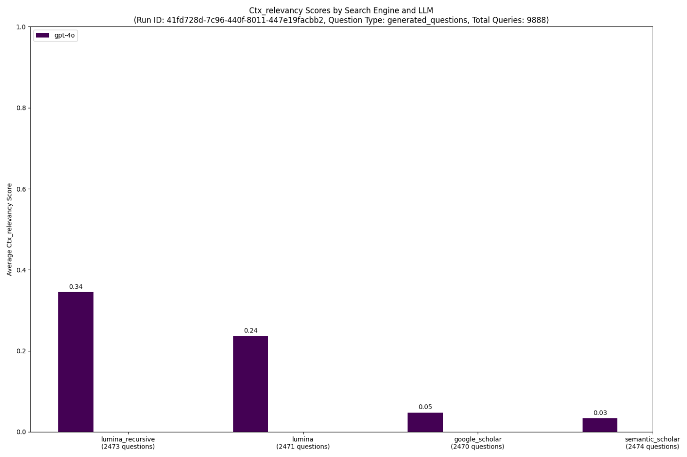

# An Open Source Evaluation for Search APIs

This repository presents a comprehensive benchmark designed to evaluate the performance of various search engines. You can plug-and-play search API's, and this benchmark works natively with lumina, exa, semantic scholar and SERP API. To begin, we are comparing the efficacy of research paper search engines. We specifically compare Lumina, Semantic Scholar, and Google Scholar (via SERP) focusing on two key metrics: Context Relevance and Context Precision. By employing large language models (LLMs) as evaluators, we assess the context relevancy and the context precision of each search result, for the top 10 search results returned by each search provider. We aim to have as fair of an evaluation as possible. We evaluate the search results returned by each provider and use zero shot (no recursion or LLM improvement) as the default method. 


# Our most recent result - Lumina is up to 11x better.

Our most recent result is a comparison between Lumina Base, Lumina Recursive, Semantic Scholar, and Google Scholar. 



We measured context relevancy for the top 10 search results returned by each search provider. 
- Lumina Base: We received a 4.8x multiple over Google Scholar and a 8x multiple over Semantic Scholar over our generated questions dataset for ~2470 queries each, for our base search.
- Lumina Pro: We received a 6.8x multiple over Google Scholar and 11.3x multiple over Semantic Scholar over our generated questions dataset for ~2470 queries each, with one recursion and a page size (number of search results) of 10, and 3 questions.

**Lumina consistently delivers 2-3 highly relevant results for every query - outperforming Google Scholar and Semantic Scholar, which provide 1 highly relevant result for 50% and 30% of the queries, respectively.**


# Running the Benchmark

This repo requires a `.env` file with API keys for each of these services. To get a lumina API_URL for lumina, and gain access to our scientific search API, you can book a meeting with me at https://cal.com/ishaank99/lumina-api.

We setup a local `postgres` instance to log the benchmark results, and a local `redis` instance for communication between the benchmark and the services. To run the benchmark with recursion, you will need to host a `reranker` service. We use the BGE Large reranker. By default this is turned off. 

You can pull and build the benchmark image from dockerhub with the following command from the root dir of the project:
```
    docker pull index.docker.io/akhilesh99/benchmark:latest
```


   1. Clone the repo and cd into it
   ```
   git clone https://github.com/lumina-chat/benchmark.git
   cd benchmark
   ```

   2. Set environment variables in .env in root of project.

   3. pull the benchmark image from dockerhub with:
   ```
    docker pull index.docker.io/akhilesh99/benchmark:latest
   ```
   4. Run `docker compose up -d` to start the benchmark. This will start all of the services defined in the `compose.yaml` file.

   ```
      docker compose up -d 
   ```
   5. Run `docker compose logs -f questions`. This will print a Streamlit link to the benchmark dashboard to view progress.

   6. To stop the benchmark, run `docker compose down`.

# Components

## `.env`

 We set up API keys, postgres and redis and config for the benchmark in this file. You should make a `.env` file at the root of the repo with these variables. We use the `config.py` file to access these variables, and the `.env` file to set them. The `python-dotenv` package is used to load the environment variables from the .env file. These include:

   - REDIS_URL
   - PG_DB_NAME
   - PG_USER
   - PG_PASSWORD
   - PG_HOST
   - PG_PORT
   - OPENAI_API_KEY
   - ANTHROPIC_API_KEY
   - EXA_API_KEY
   - SERP_API_KEY
   - SEMANTIC_SCHOLAR_API_KEY
   - API_URL (for lumina)
   - EXA_URL ("https://api.exa.ai/search")
   - EXA_CONTENT_URL ("https://api.exa.ai/contents")
   - IMG_URL ("index.docker.io/username/img:tag")
   - IMG_NAME ("username/img:tag")
   - RERANKER_URL (host a reranker if you want to do recursive search)
   - QUESTION_TYPES=user_queries,generated_questions
   - METRICS=ctx_relevancy, ctx_precision
   - LLMS=[{"name": "gpt-4o", "api": "openai", "max_tokens": 1024, "temperature": 0}, {"name": "claude-3-haiku-20240307", "api": "anthropic", "max_tokens": 1024, "temperature": 0}]
   - PROVIDERS=lumina,google_scholar,semantic_scholar,exa
   - NUM_Q=500

   (if you want recursion add a "-recursive" to the end of the provider name, like lumina_recursive,google_scholar_recursive,semantic_scholar_recursive)

## `compose.yaml`

The `compose.yaml` file orchestrates the deployment of all services required for the benchmark. It defines the configuration for each service, including dependencies, environment variables, and the number of replicas to run. This setup allows for efficient communication between the benchmark and the various search providers, as well as logging and data storage through Redis and PostgreSQL.

- **logging_api**: Handles logging of benchmark results and depends on Redis and PostgreSQL for data storage.
- **questions**: Runs the benchmark process, sending questions to the configured providers and processing their responses.
- **responses**: Manages the responses from the search providers, processing and storing the results.
- **ranking**: Responsible for ranking the responses received from the providers based on the defined metrics.
- **redis**: Provides a Redis instance for message queuing and inter-service communication.
- **pg**: Sets up a PostgreSQL database for logging benchmark results and storing relevant data.
- **adminer**: A web-based database management tool for interacting with the PostgreSQL database.

This setup allows for efficient benchmarking and evaluation of different search APIs.
## benchmark.py

The `benchmark.py` script is run separately and performs the actual benchmarking with the following parameters:

- Question types: `generated_questions` and `user_queries` 
- Metrics: `ctx_relevancy`
- LLMs: Any OpenAI or Anthropic model
- Providers: Lumina, Google Scholar, and Semantic Scholar

You can also create your own custom question datasets for benchmarking. Simply add your JSONL file to the `search_benchmark/dataset` folder and use its name (without the .jsonl extension) as a question type when running the benchmark.

### Question Types

The script uses two question types: `generated_questions` and `user_queries`. These correspond to JSONL files located in the `search_benchmark/dataset` folder. Each file contains a set of questions used for the benchmark.

- `generated_questions`: 9k AI-generated questions for benchmarking
- `user_queries`: 9k real user queries from SciSpace for more realistic testing

You don't need to run all questions, you can specify num questions in the `benchmark.py` file.
You can modify these files or add new ones to customize the benchmark according to your needs.

### Recursive search

The recursive search algorithm enhances search results by using an LLM to generate new questions based on initial search results. This process helps to fill gaps in the original results and provide more comprehensive coverage of the topic.

1. **Initial Search**: 
   - Perform an initial search using the provided question.
   - Limit results to the specified `page_size_per_recursion`.

2. **Generate New Questions**:
   - For each search result:
     - Use an LLM to analyze the result and the original question.
     - Generate new, more specific questions that address unanswered aspects. The prompt is as follows:
   ```
   Based on the user's query: "{question}", 

   the search result is: 
      {result}

   Identify parts of the user's query that were unanswered or need further refinement, and suggest a refined search query to help find better search results. 
   There should be variation in length, complexity, and specificity across the queries. 
   The query must be based on the detailed concepts, key-terms, hard values and facts in the result you've been provided.
   Wrap it in tags <query>new_query</query>.
   ```

3. **Recursive Search**:
   - Perform searches using the newly generated questions.
   - Repeat steps 1-3 until `recursion_depth` is reached.

4. **Result Processing**:
   - Combine results from all recursion levels.
   - Remove duplicate results based on the content of the chunks.

5. **Reranking**:
   - Use a reranker model to sort the combined results.
   - Return the top `page_size` results.


# Notes

To run adminer, visit localhost:8080 and use the following credentials to log in:

- System: PostgreSQL
- Server: pg
- Username: postgres
- Password: postrges
- Database: postgres
